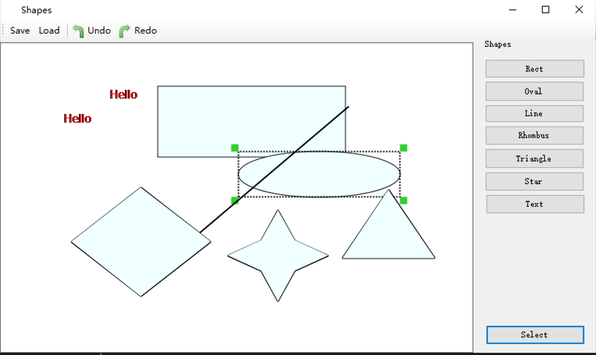

# Shape Painter

It's a paint demo with shape/layer by csharp winform.

https://www.github.com/surfsky/ShapePainter

# Features

- Shapes: line, oval, rect, rhombus, star, triangle, text
- Select
- Move
- Simply Undo/Redo
- Simply Serialize/Deserialize
- Save to png file
- Antialias

# ToDo

- Rotate.
- Modify shape's property.
- Full support for undo/redo.
- Serialize with json & zip format.

> 此项目具有试验性质，更多功能请查看项目 XPaint，该项目将参照实现跨平台的 Sketch。
